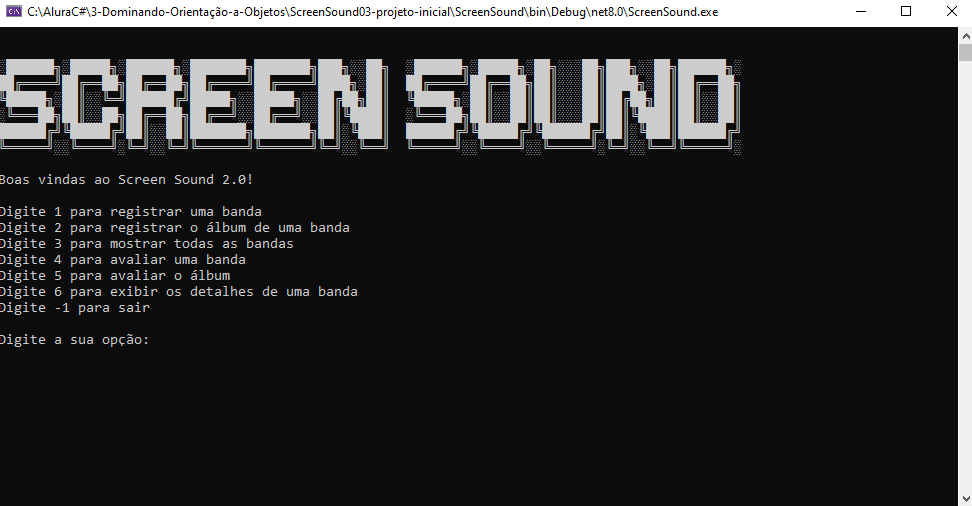

<h1>Screen Sound</h1>

A aplicação Screen Sound  é um programa de console interativo desenvolvido para a gestão de bandas musicais e suas avaliações. Projetada para facilitar o registro e a avaliação de bandas e seus álbuns, a aplicação oferece uma série de funcionalidades organizadas em um menu de opções.

<h1>Funcionalidades Principais</h1>

<h3>Registrar Bandas:</h3>
<li>Permite ao usuário adicionar novas bandas ao sistema, facilitando o acompanhamento de diferentes grupos musicais.</li>
<h3>Registrar Álbuns:
</h3>
<li>Oferece a funcionalidade de adicionar álbuns específicos para as bandas já registradas, enriquecendo o catálogo de informações disponíveis.</li>
<h3>Mostrar Todas as Bandas:
</h3>
<li>Exibe uma lista de todas as bandas registradas no sistema, proporcionando uma visão geral e rápida das bandas cadastradas.</li>
<h3>Avaliar Bandas:</h3>
<li>Permite ao usuário adicionar avaliações (notas) às bandas, ajudando a construir um histórico de feedback e qualidade percebida.</li>
<h3>Avaliar Álbuns:</h3>
<li>Similar à avaliação de bandas, esta funcionalidade permite que os álbuns sejam avaliados, ajudando a identificar os trabalhos mais bem-recebidos pelas bandas.</li>
<h3>Exibir Detalhes das Bandas:</h3>
<li>Exibe informações detalhadas sobre uma banda específica, incluindo suas avaliações e outros dados relevantes, oferecendo uma visão completa da banda e suas realizações.
</li>
<h3>Sair:</h3>
<li>Encerra a aplicação de forma segura, garantindo que o usuário possa sair do programa quando desejar.</li>
 
<h1>Como Funciona</h1>
Ao iniciar a aplicação, o usuário é recebido com uma tela de boas-vindas que exibe o logo do Screen Sound 2.0 e uma mensagem de boas-vindas. Em seguida, o menu de opções é apresentado, permitindo que o usuário escolha entre as diversas funcionalidades disponíveis digitando o número correspondente à opção desejada.

A aplicação utiliza um dicionário para armazenar as bandas e outro para as opções do menu. Dependendo da escolha do usuário, o programa chama e executa a funcionalidade correspondente, proporcionando uma experiência de uso fluida e intuitiva.

<h1>Exemplo de Uso</h1>
Um exemplo de uso da aplicação seria um usuário que deseja registrar uma nova banda chamada "The Rolling Stones". O usuário seleciona a opção de registrar uma banda, insere o nome "The Rolling Stones", e a banda é adicionada ao sistema. Posteriormente, o usuário pode adicionar álbuns e avaliações para essa banda, além de visualizar detalhes e comparar com outras bandas registradas.

