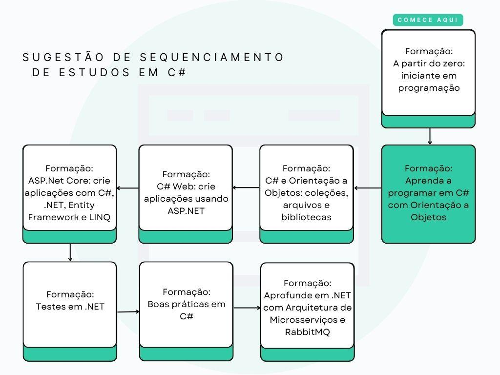

<h1>Aprendendo a programar em C# com Orientação a Objetos</h1>

<h2>O QUE VOCÊ VAI APRENDER NESTA FORMAÇÃO</h2>

Nesta formação você vai aprender o necessário para iniciar o desenvolvimento de aplicações usando C# e terá acesso a tudo o que precisa para dominar desde os fundamentos da linguagem C# até as melhores práticas de codificação e modelagem, utilizando o poderoso paradigma da programação orientada a objetos. Junte-se a nós nesta jornada e conheça o vasto ecossistema de desenvolvimento .NET.

<h2>C#, .NET E SUA IMPORTÂNCIA</h2>

C# é uma linguagem de programação moderna, robusta e de propósito geral, desenvolvida pela Microsoft. Ela foi projetada para ser simples, eficiente e orientada a objetos. C# oferece recursos avançados de programação, como tratamento de exceções, coleta de lixo automática e suporte a tipos de dados avançados, além de ser altamente integrada com o ecossistema .NET.

O framework .NET, por sua vez, é uma plataforma de desenvolvimento criada pela Microsoft, que inclui uma vasta coleção de bibliotecas, ferramentas e componentes para construir e executar aplicativos em diferentes sistemas operacionais, como Windows, macOS e Linux, e também em diferentes plataformas, como computadores desktop, servidores, celulares, motores de jogos, SmartTVs, dentre outros . . Ele fornece uma base sólida para desenvolver aplicativos escaláveis, seguros e de alto desempenho.

Tanto a linguagem C# e o framework .NET são amplamente adotados pela indústria de software. Eles oferecem uma combinação poderosa de facilidade de uso, desempenho e escalabilidade, tornando-os uma escolha popular para o desenvolvimento de uma ampla gama de aplicativos, desde aplicações desktop e web até aplicativos móveis e jogos. Além disso, a comunidade em torno do C# e do .NET é ativa e solidária, fornecendo recursos, suporte e atualizações constantes. Isso torna a aprendizagem e a utilização dessas tecnologias uma escolha sólida para devs em busca de eficiência, produtividade e sucesso no desenvolvimento de software.

